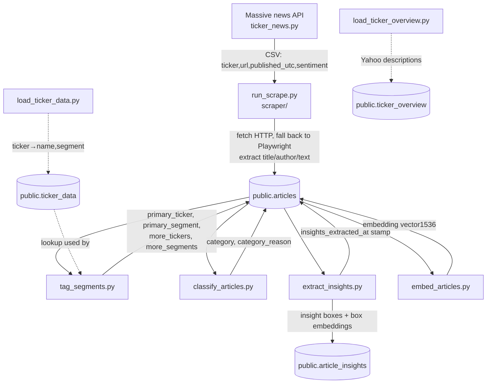
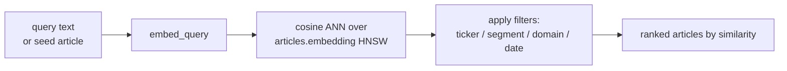
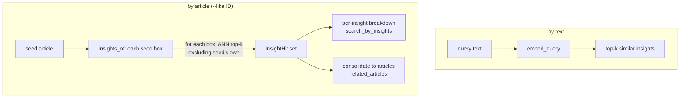
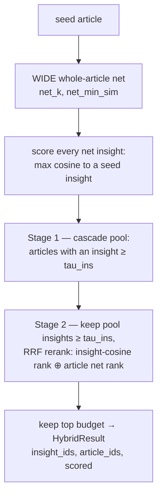
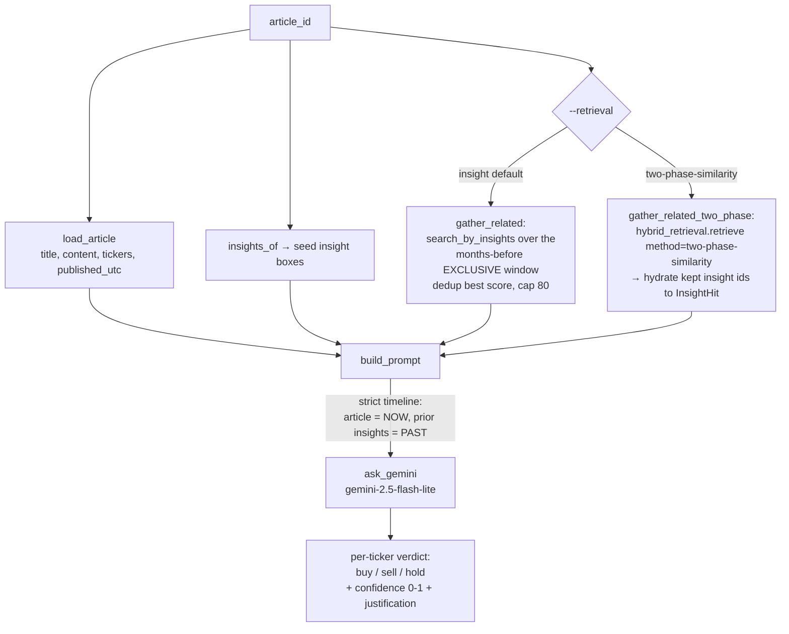
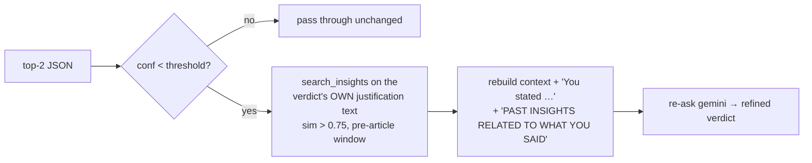
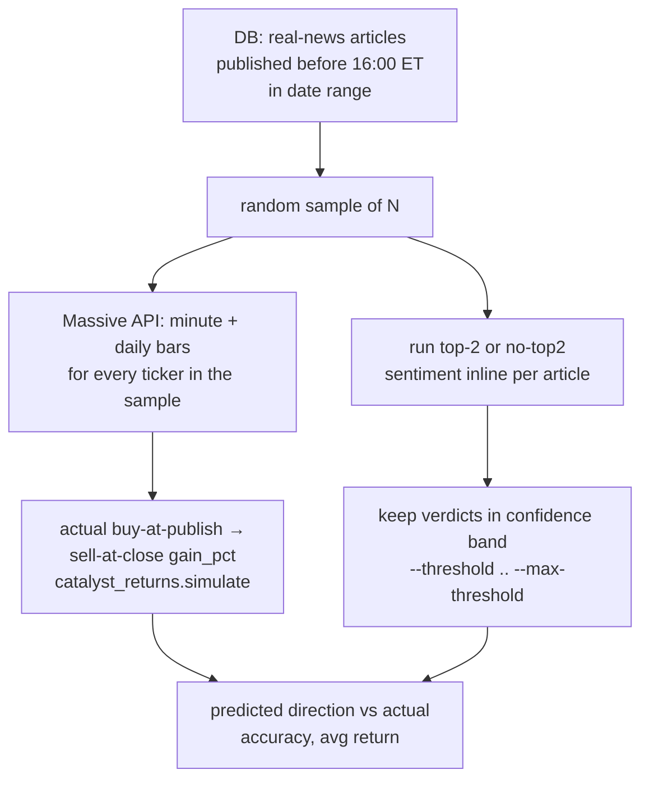

# System Flows

This document describes the three core flows of the Ticker News Analyzer:

1. **[Article ingestion](#1-article-ingestion-flow)** — from scraping a URL to a fully
   tagged, classified, insight-chunked, embedded row in the DB.
2. **[RAG retrieval](#2-rag-retrieval-flow)** — finding related coverage at whole-article
   granularity, at insight granularity, and via hybrid methods that combine the two
   (incl. the two-stage `two-phase-similarity` retriever).
3. **[Sentiment querying](#3-sentiment-querying-flow)** — judging the immediate
   market reaction to an article, with no-lookahead context retrieval.

Everything lives in one Postgres database (`sharedproject`, with the **pgvector**
extension). The connection comes from `NEWS_DB_DSN` / `DATABASE_URL`; if unset, scripts
fall back to a local `dbname=news` (content-poor) — always export `NEWS_DB_DSN` to point
at the content-rich DB.

Two embeddings share **one vector space** — OpenAI `text-embedding-3-small` (1536-dim):
`public.articles.embedding` (whole article) and `public.article_insights.embedding`
(one per insight box). Because the model and space are identical, articles and insights
are mutually searchable.

---

## 1. Article ingestion flow



### Stage 0 — Universe & reference data (prerequisites)

| Script | Writes | Purpose |
|---|---|---|
| `scripts/enrichment/load_ticker_data.py` | `public.ticker_data (ticker, company_name, segment)` | The 118-ticker universe + AI-segment map. **Required before tagging.** |
| `scripts/enrichment/load_ticker_overview.py` | `public.ticker_overview` | Yahoo Finance company descriptions (reference). |
| `scripts/data_getting_parsing/ticker_news.py` | `news.csv` | Pulls per-ticker news (URL, publish time, Massive's own sentiment) from the Massive REST API. This CSV is the **work list** the scraper consumes. |

### Stage 1 — Scrape (`run_scrape.py` → `scraper/`)

The async pipeline (`scraper/pipeline.py`) reads jobs from the CSV and, per URL:

1. **Robots check** (optional) → blocked URLs are saved with `status='error'`.
2. **HTTP fetch** with retries (`scraper/fetch.py`); on a bad/weak response, falls back
   to a **Playwright browser** fetch (handles JS-rendered / anti-bot pages).
3. **Extract** title, author, body text, language, word count
   (`scraper/extract/`, with per-publisher overrides e.g. `benzinga_com.py`).
4. **Store** into `public.articles` via an idempotent `INSERT … ON CONFLICT (url) DO
   UPDATE` (`scraper/store/db.py`). Each save is its own transaction (autocommit), so a
   run is safe to kill and resume; already-`ok` URLs are skipped unless `--retry-errors`.

Resulting `articles` columns at this stage: `url, url_canonical, source_domain,
publisher, tickers (text[]), published_utc, title, author, content, raw_html, lang,
word_count, fetch_method, http_status, status, error, fetched_at, extracted_at`.

### Stage 2 — Tag tickers & segments (`tag_segments.py`)

Derives four columns from the `tickers` array **and** by scanning title+content text:

| Column | Meaning |
|---|---|
| `primary_ticker` | First ticker in the `tickers` array. |
| `primary_segment` | That ticker's AI segment (from `ticker_data`). |
| `more_tickers (text[])` | Every *other* universe ticker mentioned — found via cashtag (`$NVDA`), exchange prefix (`NASDAQ: NVDA`), parenthesised symbol, unambiguous bare symbols, and company-name/alias matching — unioned with the rest of the `tickers` array. |
| `more_segments (text[])` | Distinct additional segments beyond the primary. |

Ambiguous short symbols (`AI`, `ON`, `ARM`, …) only match in strong contexts to avoid
false positives. **Idempotent**: by default only rows with `primary_ticker IS NULL` are
processed (`--not-only-missing` recomputes all). Builds ticker/segment indexes.

### Stage 3 — Classify content type (`classify_articles.py`)

Labels each article into exactly one `category` (+ `category_reason`) via a constrained
Gemini `response_schema` enum. **Two-pass** strategy:

1. **First pass** — `gemini-2.5-flash-lite` (fast/cheap) on every article.
2. **Confirmation pass** — if the first pass says **`real news`**, the same prompt is
   re-run on the stronger **`gemini-2.5-flash`**, which keeps or corrects the label.
   Other categories are accepted as-is (no second call).

Categories: `conference-PR, marketing fluff, real news, recap/review, market
speculation, legal solicitation, regulatory filing, book PR, politics/macro, other`.
The key boundary the prompt enforces: **`real news`** is first-hand reporting of a *new*
event; explainers of an already-happened move ("why X stock plummeted today") are
**`recap/review`**. **Idempotent**: only `category IS NULL` rows by default
(`--reprocess` / `--ids` to override).

> `scripts/classify/reclassify_real_news.py` is a one-off utility that re-runs only the
> existing `real news` rows through `gemini-2.5-flash` to purge recaps that the lite
> pass had let through (429-aware retry).

### Stage 4 — Extract insight boxes (`extract_insights.py`)

The heart of the RAG corpus. Sends each article to `gemini-2.5-flash-lite` (504-fallback
to `gemini-2.5-flash`) asking for an array of **insight boxes**, each:

```
TOPIC: <short label>
INSIGHT: <1-2 sentence takeaway + bullish/bearish implication>
QUOTES:
<verbatim quote 1>
<verbatim quote 2>
```

Processing per box:
- **Verbatim quotes** — each model quote is matched back to the source article (exact,
  else fuzzy ≥ 0.75); non-matching quotes are **dropped** (no hallucinated quotes).
- **Headline prefix** — the box is stored with a leading `ARTICLE_HEADLINE:` line so the
  source context travels with the box and gets embedded.
- **Ticker↔company cross-annotation** — `NVDA` → `NVDA (NVIDIA)` and vice-versa in the
  TOPIC/INSIGHT region (quotes left byte-for-byte).

Each box is one row in `public.article_insights` (`article_id` FK, denormalized
`source_url`/`article_headline`, `box_index`, `topic`, `insight`, `quotes text[]`,
`box_text`, `model`, `embedding vector(1536)`). Boxes are then embedded with OpenAI
`text-embedding-3-small`; an **HNSW cosine index** is built.

**Idempotency** is subtle: an article counts as processed once it has insight rows **OR**
`articles.insights_extracted_at` is stamped. The stamp is what prevents pure-boilerplate
articles (which correctly yield **zero** boxes) from being re-sent to the LLM every run.

### Stage 5 — Embed whole articles (`embed_articles.py`)

Embeds `title + content` for each article into `articles.embedding (vector 1536)` with
the same `text-embedding-3-small` model, then builds the HNSW cosine index
(`articles_embedding_idx`). **Resumable**: only `embedding IS NULL` rows (`--reembed` to
recompute).

---

## 2. RAG retrieval flow

Two retrieval tools, sharing the query embedder (`embed_articles.embed_query`) and the
single vector space. Both support filters: `--ticker`, `--segment`, `--domain`,
`--since/--until`, and the **no-lookahead** window (`--months-before N`, `--exclusive`).

### 2a. Whole-article search (`search_articles.py`)

Coarse "find similar articles" over `articles.embedding`.



Modes:
- **Text query** — `search("nvidia data center demand", k=5, tickers=["NVDA"])`.
- **More-like-this** — `similar_to(article_id)` / `similar_to_url(url)`.
- **Scoped statements** — a statement (or a JSON file of `{statement, scope, value}`)
  evaluated against the whole DB, a ticker, or a segment, optionally dated relative to a
  linked article (`--months-before`) for backtest-safe retrieval.

### 2b. Insight-level search (`search_articles_by_insights.py`)

Fine-grained retrieval over `article_insights.embedding` — matches *ideas*, not whole
documents. This is the module the sentiment flow builds on.



Public API (reused elsewhere):

| Function | Returns |
|---|---|
| `search_insights(query, …)` | Top-`k` insights most similar to free text. |
| `insights_of(conn, article_id)` | The seed article's embedded boxes (`SeedInsight`s). |
| `search_by_insights(article_id, k, …)` | For **each** seed box, its top-`k` similar insights elsewhere (`InsightGroup`s); seed's own insights excluded. |
| `related_articles(article_id, …)` | Those hits **consolidated** into source articles, ranked by best insight similarity, # of seed insights matched, then summed similarity. |
| `_seed_window(pub, months_before, exclusive)` | The `(since, until)` no-lookahead date bounds anchored on the seed's publish time. |

**No-lookahead** (`--exclusive`): the upper bound is the seed's exact timestamp, so no
insight published at/after the seed leaks into the context — essential for honest
backtesting. ANN robustness under selective filters is handled by per-query HNSW GUCs
(`hnsw.ef_search`, `hnsw.iterative_scan`), so a date+ticker filter still returns matches.

### 2c. Hybrid retrieval (`hybrid_retrieval.py`)

Whole-article and insight-level search are **complementary**: the article net has higher
**recall** (it nets the right documents), the insight net has higher **precision** (it
matches the right *ideas*). The validation work (`docs/validations/validate_retrieval.md`)
showed that whichever method is applied **last as a hard gate caps recall at that
method's recall** — so the high-recall method must be the wide net and the high-precision
method the filter. `hybrid_retrieval.retrieve(seed_id, method=…)` exposes four ways to
combine them, all anchored on the seed and its no-lookahead `(since, until)` window:

| `method` | Idea | Trade-off |
|---|---|---|
| `intersection` | Keep insights whose article is in **both** the insight top-`k` and the whole-article top-`k`. | Max precision; recall ≤ insight-alone (the naive overlap). |
| `cascade` | **WIDE** whole-article net (large `net_k`, low `net_min_sim`) → score every insight inside the net against the seed's insights, keep those ≥ `tau_ins`. | Recall ceiling = whole-article (high); precision restored by the insight filter. |
| `fusion` | Reciprocal-rank fusion (RRF) of two insight rankings: insight-ANN cosine **and** the rank of the insight's article in the whole-article net. Keep the top `budget`. | Highest recall ceiling (a union); precision controlled by the cutoff. |
| **`two-phase-similarity`** | **Two stages.** ① *cascade pool*: a wide article net gated to articles having ≥ 1 insight with max-cosine-to-seed ≥ `tau_ins` (cascade's high-recall article set). ② *fusion over the relevant pool insights*: of the pool articles' insights, keep only those that **themselves** clear `tau_ins`, RRF-rank them by cosine-to-seed rank ⊕ article net rank, and keep the top `budget`. | Recall ceiling = the cascade pool (high); precision = the per-insight `tau_ins` gate + fusion's rerank + `budget`. The best all-rounder. |



`retrieve(...)` returns a `HybridResult` (`insight_ids`, `article_ids`, and per-insight
`scored` tuples); the `score` for `two-phase-similarity`/`fusion` is the RRF score, for
`cascade`/`intersection` it's the insight-to-seed cosine. Knobs: `net_k` (default 150),
`rrf_c` (60), `budget`, plus the two cosine floors `net_min_sim` (article-level) and
`tau_ins` (insight-level). These are **method-aware**: `two-phase-similarity` uses
**asymmetric** floors — a *loose* article net (`net_min_sim` **0.55**) to fill the pool for
recall and a *tight* insight gate (`tau_ins` **0.75**) to hold precision — with a **40**-insight
`budget`, while `cascade`/`fusion` keep the wide-net `0.45` / `0.70` and a `50` budget. The
tuning rationale is in `docs/validations/validate_retrieval.md` §10 (the `0.55/0.75/40` point
beat the earlier symmetric-`0.8` and `0.7` configs); the sweep harness lives in
`scripts/validate_retreival/sweep_two_phase.py`.

---

## 3. Sentiment querying flow

Judges the **immediate** market reaction to an article at its publish moment, using only
information available *then*.

### 3a. Single-article sentiment (`insight_sentiment.py`)



The prompt enforces a strict timeline: **the article is breaking now**, its own insights
are now, and all **related prior insights are PAST / already priced in** (used only to
judge how *surprising* the news is — never as a fresh catalyst). Each ticker is judged on
its own merits (one article can be bullish for one ticker and bearish for a rival).

**Related-insight retrieval** is selectable via `--retrieval`:
- `insight` (default) — `gather_related` → `search_by_insights` (insight-level ANN, §2b).
- `two-phase-similarity` — `gather_related_two_phase` → `hybrid_retrieval.retrieve(method="two-phase-similarity")` (§2c),
  then the kept insight ids are hydrated back into `InsightHit` rows for the prompt. The
  two-phase-similarity knobs (`--net-k`, `--net-min-similarity`, `--tau-insight`, `--budget`) are exposed
  on the CLI and apply only in this mode.

**Ticker-set modes:**

| Invocation | Behavior |
|---|---|
| `insight_sentiment.py <id>` (≥3 tickers) | One joint call judging every ticker the article names. |
| `insight_sentiment.py <id>` (<3 tickers, no `--ticker`) | **One separate call per ticker** (avoids a thin joint prompt). |
| `--ticker INTC` | Judge only that one ticker. |
| `--top-2` (≥3 tickers) | Joint call, then **re-run the 2 highest-confidence non-hold tickers** each on its own; emits a consolidated JSON (`joint`, `top2_separate`, `top2_tickers`). Falls back to per-ticker calls (with a warning) when the article has <3 tickers. |

Output model: `gemini-2.5-flash-lite`, `temperature=0`, constrained to
`[{ticker, action, confidence, justification}]` via `response_schema`. Each verdict is
tagged `role: primary|mentioned`.

### 3b. Follow-up refinement (`followup_sentiment.py`)

Takes a `--top-2` JSON and, for each separate verdict **below a confidence threshold**
(default 0.8), enriches and re-asks:



This is a reflexive second pass: it retrieves past insights semantically similar to the
model's *own reasoning* and feeds them back, so the model can confirm or revise (commonly
realizing the news was "already priced in"). Needs `OPENAI_API_KEY` (to embed the
justification) in addition to `GOOGLE_API_KEY`.

### 3c. Backtest harness (`backtest_top2.py`)

Measures signal quality against realized returns. **Writes nothing to the DB.**



- **Candidates** come straight from the DB (`category='real news'`, published before
  after-hours), not a fixed CSV.
- **Actual returns** reuse `catalyst_returns.simulate` (buy at the first minute bar at/after
  the headline, sell at the regular-session close; after-hours excluded).
- **Modes**: `--top-2` (default) or `--no-top2` (judge every ticker once); confidence is
  filtered to a band `[--threshold, --max-threshold]`.
- Output: a per-verdict table (predicted action vs `actual_gain_pct`, ✓/✗), buy/sell
  accuracy split, and a JSON dump.

> **Caveat for interpretation:** a strongly trending market biases directional accuracy
> (e.g. Feb–Mar 2025 fell ~10% on the Nasdaq, so "sell" calls had a tailwind). For true
> edge, compare each gain against the same-day index move (alpha), not absolute return.

---

## Quick reference — what each stage writes

| Table | Key columns | Written by |
|---|---|---|
| `public.articles` | scrape fields; `primary_ticker`, `primary_segment`, `more_tickers`, `more_segments`; `category`, `category_reason`; `insights_extracted_at`; `embedding vector(1536)` | scraper → tag → classify → extract → embed |
| `public.article_insights` | `article_id` FK, `box_index`, `topic`, `insight`, `quotes[]`, `box_text`, `model`, `embedding vector(1536)` | `extract_insights.py` |
| `public.ticker_data` | `ticker`, `company_name`, `segment` | `load_ticker_data.py` |
| `public.ticker_overview` | Yahoo company descriptions | `load_ticker_overview.py` |

## Models used

| Purpose | Model |
|---|---|
| Classification (pass 1 / confirm) | `gemini-2.5-flash-lite` / `gemini-2.5-flash` |
| Insight extraction | `gemini-2.5-flash-lite` (504-fallback `gemini-2.5-flash`) |
| Sentiment & follow-up | `gemini-2.5-flash-lite` |
| Embeddings (articles + insights) | OpenAI `text-embedding-3-small` (1536-dim) |
| Prices / news source | Massive REST API |
